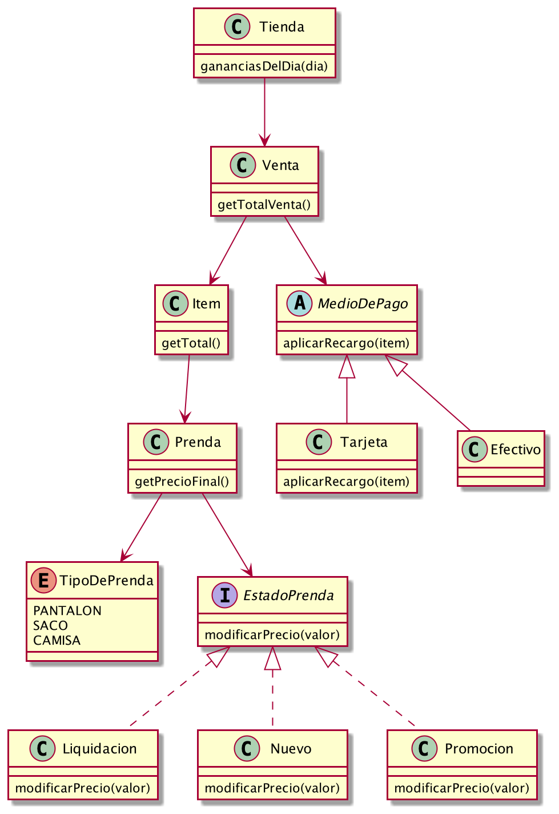

### Requerimientos

- Saber el precio de venta y el tipo de una Prenda
- Registrar la venta de Prendas
- Saber las ganancias de un día determinado
- Permitir la modificación del costo total a partir del pago con tarjeta

### Diagrama de Clases



### Explicación

Se considera que la clase Tienda corresponde a los distintos locales de Macowins que podrían llegar a registrar ventas.
Es por eso que dicha clase está compuesta por un listado de ventas y es la encargada de implementar la función ```gananciasDelDia```

También se toma en cuenta que en un futuro pueda cambiar el descuento que se realiza para las prendas en promoción, 
pero solo ante un eventual cambio en las reglas de negocio. Es por eso que se deja como una variable estática y 
no se incorpora en el constructor de Liquidacion

### Descartado

Se descartó la opción de hacer que prenda fuera una clase abstracta, donde cada tipo de prenda extendiera dicha clase. 
Se considera que no aporta ningún valor hacer una clase particular para cada tipo de prenda. Pues dentro de 
los requerimientos del cliente solo se pide el precio de la misma, por lo tanto no hay diferencia entre los distintos 
tipos de prenda.

Además sumaria complejidad a la hora de incorporar nuevos tipos de prendas, ya que habría que desarrollar una clase 
entera nueva, implementar los métodos de la supuesta clase abstracta prenda, etc. 

Distinto seria si por ejemplo, el cliente detallara que quiere saber para cada tipo de prenda cuanta tela se necesita. 
En ese caso si habría diferencias entre los distintos tipos de prendas. 